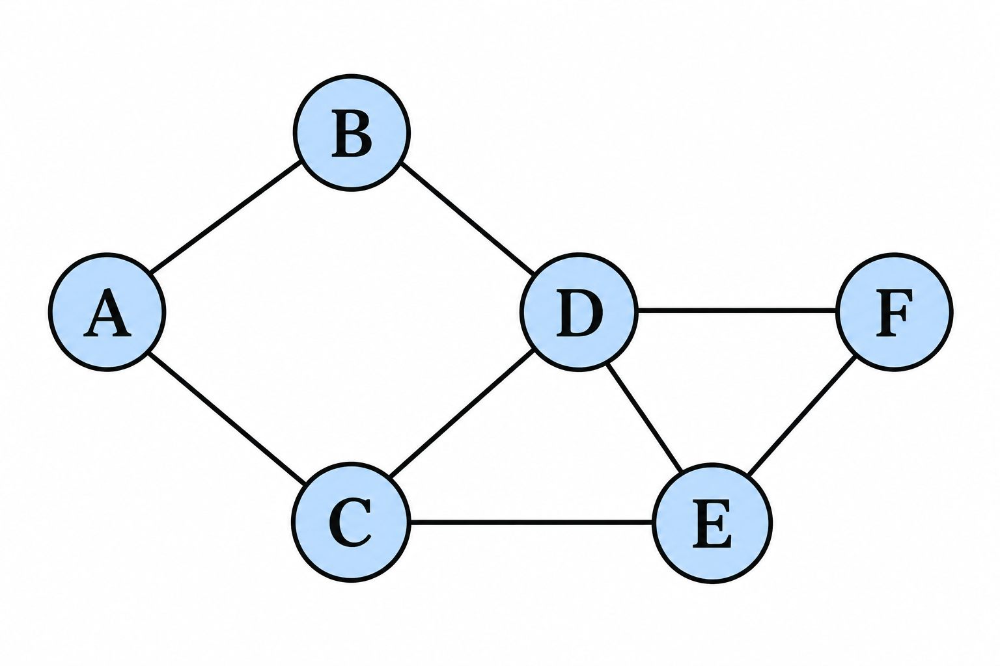
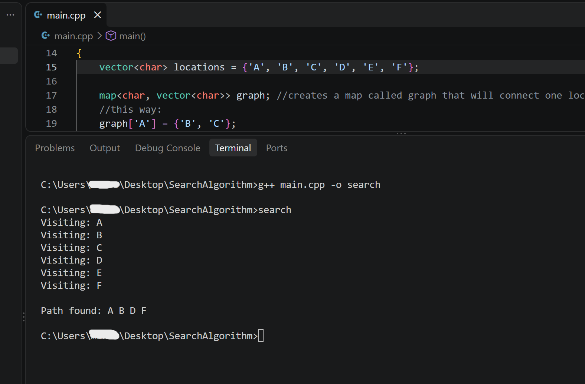

# BFS Pathfinding

A C++ implementation of Breadth-First Search (BFS) for finding a path between locations in an unweighted graph.

## Author

Mahsa Fazli

## Project Overview

This project uses Breadth-First Search (BFS) to solve a pathfinding problem. The graph contains six locations: A, B, C, D, E, and F.

The initial state is **A**, and the goal state is **F**. From each location, movement is possible to any directly connected location.



Since all connections are considered equal, BFS can find a path with the minimum number of connections from A to F.

## Algorithm Implementation

The program is implemented in C++ and uses:

- A **queue** to store discovered locations that still need to be explored.
- A **visited vector** to keep track of locations that have already been discovered.
- A **parent map** to record where each location was reached from and reconstruct the final path.

### BFS Steps

1. Start at A, add it to the queue, and mark it as visited.
2. Explore A and discover its neighbors B and C.
3. Explore B and discover D. Add D to the queue and save B as its parent.
4. Explore C and discover E. D is ignored because it has already been discovered.
5. Explore D and discover F.
6. Stop the search when F is reached.
7. Trace the parent map backward: `F → D → B → A`.
8. Reverse the result to obtain the final path: `A → B → D → F`.

Checking whether a location has already been visited prevents the program from repeatedly exploring the same locations and avoids cycles.

## Performance Analysis

For a standard BFS using efficient visited-state lookup, the time complexity is:

**O(L + C)**

where:
- `L` = number of locations
- `C` = number of connections

In this implementation, a vector and `find()` are used to check whether a location has been visited. Because this lookup is linear, it can add additional runtime compared with a constant-time visited lookup. For this small graph, the additional cost is negligible.

The extra space used by the queue, visited list, and parent map is **O(L)**.

Including storage for the graph itself, the total space complexity is **O(L + C)**.

## Concepts Demonstrated

- Breadth-First Search (BFS)
- Graph traversal
- Pathfinding
- Queue data structure
- Visited-state tracking
- Parent-based path reconstruction
- Time and space complexity
- Cycle prevention

## How to Run

Compile:

```bash
g++ main.cpp -o search
```

Run:

```bash
./search
```

On Windows PowerShell:

```powershell
.\search.exe
```

## Program Output

The program displays the BFS exploration and the resulting path from the initial location to the goal.



## Coursework

This project was developed as part of my Artificial Intelligence coursework at Lakehead University.
